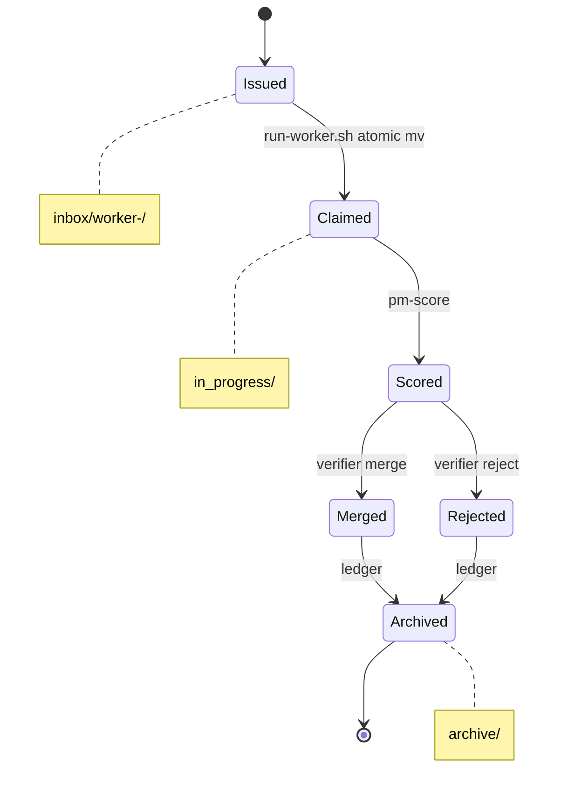

# autopilot-swarm

Autonomous multi-agent swarm for any project. 1 PM (claude opus 4.7) orchestrates
4-10 workers (claude opus/sonnet/haiku, codex/gpt-5) inside a single tmux session.
Workers each get an isolated git worktree, claim tickets from a file-based bus,
run headless `claude -p` / `codex exec`, commit to their own branch. The PM scores
results with `quality-eval`, applies incentive/penalty weights, cherry-picks
winners into `main`, and continuously dispatches new tickets grounded in
notebooklm + obsidian + context7 + web research.

## Install

Already in `~/.claude/plugins/autopilot-swarm/`. Register in `~/.claude/marketplace.json`
or just call the skills directly.

## Prerequisites

```bash
brew install tmux jq gettext            # gettext provides envsubst
brew install gh                         # optional — enables auto-PR per ticket
# Claude CLI w/ `claude -p`, Codex CLI w/ `codex exec`
# `quality-eval` skill installed under ~/.claude/skills/
```

Auto-PR mode kicks in when `gh` is installed AND the repo has an `origin`
remote. Each successful worker ticket → its own branch `autopilot/T-<id>` off
`main` + `gh pr create`. Without `gh`/`origin`, workers fall back to the
shared per-worker branch (no push, local-only).

Target project must be a git repo with at least one commit and a configured identity:
```bash
git rev-parse --verify HEAD           # must succeed
git status --short                    # should be clean
git config user.email                 # must be non-empty
git config user.name                  # must be non-empty
```
For a brand-new project:
```bash
git init
git add <files>
git commit -m "initial commit"
git config user.email "<your-address>"  # only if not set globally
git config user.name "Your Name"
```

NotebookLM, Obsidian, Context7, and web-search MCPs are optional — PM degrades
gracefully and logs `skill unavailable: <name>` for each missing source.

## Quick start

From any project root:

```bash
# 1. choose worker models + count interactively
/autopilot-swarm:swarm-init

# 2. launch session in current terminal
/autopilot-swarm:autopilot-swarm

# 3. inject a ticket manually (optional — PM auto-dispatches)
/autopilot-swarm:swarm-ticket worker-1 "Refactor src/foo to drop dead code"

# 4. live status
/autopilot-swarm:swarm-status

# 5. compare swarm vs solo claude vs solo codex
/autopilot-swarm:swarm-bench

# 6. stop
/autopilot-swarm:swarm-stop          # tmux only
/autopilot-swarm:swarm-stop --purge  # also remove worktrees + branches
```

## Roles

| Pane | Role | Model |
|---|---|---|
| 0 | PM | claude `opus-4-7` (forced) |
| 1..N | Worker | configurable: opus-4-7, sonnet-4-6, haiku-4-5, codex(gpt-5) |

Role hints: `reasoning` → opus, `speed` → sonnet, `bulk` → haiku, `codegen` → codex.

## Knowledge sources (per session bootstrap)

- **swarm-explorer agent** — scans current project: language, framework, entry
  points, test setup, top files
- **notebooklm skill** — pulls relevant notebooks
- **claude-obsidian:wiki-query skill** — searches user vaults
- **context7 MCP** — fetches up-to-date library docs
- **tavily / brave-search MCP** — web (YouTube, Reddit, dev communities)

All distilled into `<project>/.planning/autopilot/knowledge/`.

## File bus

```
<project>/.planning/autopilot/
├── inbox/worker-N/<id>.json
├── in_progress/<id>.json
├── outbox/worker-N/<id>.md
├── results/<id>/{diff.patch,commit.sha}
├── done/<id>.json
├── scores/<id>.json
├── ledger/agent-scores.json
├── knowledge/{project-snapshot,ai-engineering,harness-engineering,topics}.{md,json}
├── archive/
└── logs/
```

## Ticket Lifecycle

Every ticket walks the file bus through a small set of states. The diagram
below renders the canonical happy path plus the reject branch as an embedded
mermaid `stateDiagram-v2`. Ground-truth code: `scripts/run-pm.sh` (PM side)
and `scripts/run-worker.sh` (worker side).



Two race hot-spots govern correctness. (1) The `inbox` → `in_progress` claim
is a POSIX rename (`mv`) in `/Users/lyan/.claude/plugins/autopilot-swarm/scripts/run-worker.sh`
— atomic on the same filesystem, so the losing worker gets a nonzero exit and
re-polls instead of double-claiming. (2) The PM merge-lock
(`dispatch.lock.d` mkdir-lock) in `/Users/lyan/.claude/plugins/autopilot-swarm/scripts/run-pm.sh`
serializes ticket dispatch against the `swarm-ticket` skill and guards the
cherry-pick of `Merged` results into `main`; if the holder dies mid-write the
lock is reclaimed after ~30s. Both flows ultimately fall through to `archive`
so the bus stays drainable.

## Self-improvement

`pm-self-improve` prompt makes the PM issue tickets against the plugin repo
itself (`~/.claude/plugins/autopilot-swarm/`). Drop one ticket and the swarm
will iteratively review and refine its own machinery using the
`adversarial-review-loop` skill.

## Safety

- Engines run with `--dangerously-skip-permissions` (claude) and `--full-auto`
  (codex) — required for autonomous operation. Blast radius is bounded:
  - Every worker edits only its own worktree (`<basename>-worker-N/`).
  - PM is the **only** process that touches the project's default branch
    (cherry-pick of merged commits). It never `git push`es.
  - `swarm-stop --purge` deletes worktrees + autopilot/* branches but never
    `main`. Confirm before purging if there are uncommitted changes you care
    about.
- `swarm-init` requires the project to be a git repo (worktrees demand it).
- All ticket data lives under `.planning/autopilot/` — add to `.gitignore` if
  you don't want it tracked.

## Benchmark

`/autopilot-swarm:swarm-bench` runs the same task three ways:
1. swarm (PM + 4-10 workers)
2. `claude -p` opus-4-7 alone
3. `codex exec` gpt-5 alone

Each result is scored by `quality-eval`. Report saved to
`.planning/autopilot/bench/<timestamp>/report.md`.
