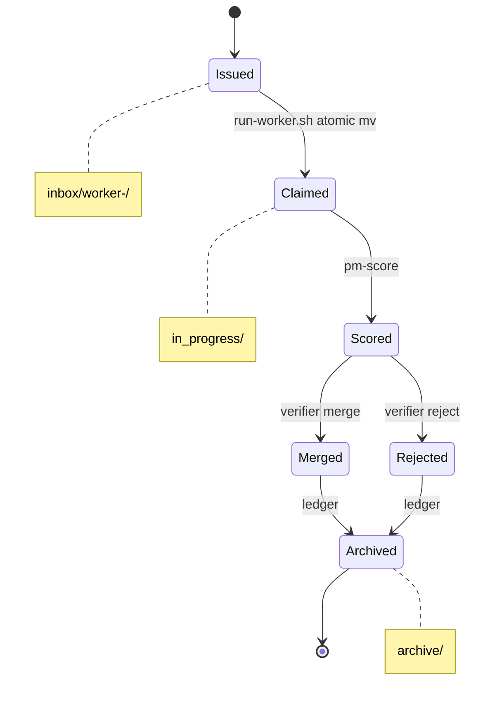

# autopilot-swarm

Autonomous multi-agent swarm for any project. 1 PM (claude opus 4.7) orchestrates
4-10 workers (claude opus/sonnet/haiku, codex/gpt-5) inside a single tmux session.
Workers each get an isolated git worktree, claim tickets from a file-based bus,
run headless `claude -p` / `codex exec`, commit to their own branch. The PM scores
results with `quality-eval`, applies incentive/penalty weights, cherry-picks
winners into `main`, and continuously dispatches new tickets grounded in
notebooklm + obsidian + context7 + web research.

## Install

Already in `~/.claude/plugins/autopilot-swarm/`. Register in `~/.claude/marketplace.json`
or just call the skills directly.

## Prerequisites

```bash
brew install tmux jq gettext            # gettext provides envsubst
brew install gh                         # optional — enables auto-PR per ticket
# Claude CLI w/ `claude -p`, Codex CLI w/ `codex exec`
# `quality-eval` skill installed under ~/.claude/skills/
```

Auto-PR mode kicks in when `gh` is installed AND the repo has an `origin`
remote. Each successful worker ticket → its own branch `autopilot/T-<id>` off
`main` + `gh pr create`. Without `gh`/`origin`, workers fall back to the
shared per-worker branch (no push, local-only).

Target project must be a git repo with at least one commit and a configured identity:
```bash
git rev-parse --verify HEAD           # must succeed
git status --short                    # should be clean
git config user.email                 # must be non-empty
git config user.name                  # must be non-empty
```
For a brand-new project:
```bash
git init
git add <files>
git commit -m "initial commit"
git config user.email "<your-address>"  # only if not set globally
git config user.name "Your Name"
```

NotebookLM, Obsidian, Context7, and web-search MCPs are optional — PM degrades
gracefully and logs `skill unavailable: <name>` for each missing source.

## Quick start

From any project root:

```bash
# 1. choose worker models + count interactively
/autopilot-swarm:swarm-init

# 2. launch session in current terminal
/autopilot-swarm:autopilot-swarm

# 3. inject a ticket manually (optional — PM auto-dispatches)
/autopilot-swarm:swarm-ticket worker-1 "Refactor src/foo to drop dead code"

# 4. live status
/autopilot-swarm:swarm-status

# 5. compare swarm vs solo claude vs solo codex
/autopilot-swarm:swarm-bench

# 6. stop
/autopilot-swarm:swarm-stop          # tmux only
/autopilot-swarm:swarm-stop --purge  # also remove worktrees + branches
```

## Roles

| Pane | Role | Model |
|---|---|---|
| 0 | PM | claude `opus-4-7` (forced) |
| 1..N | Worker | configurable: opus-4-7, sonnet-4-6, haiku-4-5, codex(gpt-5) |

Role hints: `reasoning` → opus, `speed` → sonnet, `bulk` → haiku, `codegen` → codex.

## Knowledge sources (per session bootstrap)

- **swarm-explorer agent** — scans current project: language, framework, entry
  points, test setup, top files
- **notebooklm skill** — pulls relevant notebooks
- **claude-obsidian:wiki-query skill** — searches user vaults
- **context7 MCP** — fetches up-to-date library docs
- **tavily / brave-search MCP** — web (YouTube, Reddit, dev communities)

All distilled into `<project>/.planning/autopilot/knowledge/`.

## File bus

```
<project>/.planning/autopilot/
├── inbox/worker-N/<id>.json
├── in_progress/<id>.json
├── outbox/worker-N/<id>.md
├── results/<id>/{diff.patch,commit.sha}
├── done/<id>.json
├── scores/<id>.json
├── ledger/agent-scores.json
├── knowledge/{project-snapshot,ai-engineering,harness-engineering,topics}.{md,json}
├── archive/
└── logs/
```

## Ticket Lifecycle

Every ticket walks the file bus through a small set of states. The diagram
below renders the canonical happy path plus the reject branch as an embedded
mermaid `stateDiagram-v2`. Ground-truth code: `scripts/run-pm.sh` (PM side)
and `scripts/run-worker.sh` (worker side).



Two race hot-spots govern correctness. (1) The `inbox` → `in_progress` claim
is a POSIX rename (`mv`) in `/Users/lyan/.claude/plugins/autopilot-swarm/scripts/run-worker.sh`
— atomic on the same filesystem, so the losing worker gets a nonzero exit and
re-polls instead of double-claiming. (2) The PM merge-lock
(`dispatch.lock.d` mkdir-lock) in `/Users/lyan/.claude/plugins/autopilot-swarm/scripts/run-pm.sh`
serializes ticket dispatch against the `swarm-ticket` skill and guards the
cherry-pick of `Merged` results into `main`; if the holder dies mid-write the
lock is reclaimed after ~30s. Both flows ultimately fall through to `archive`
so the bus stays drainable.

## Self-improvement

`pm-self-improve` prompt makes the PM issue tickets against the plugin repo
itself (`~/.claude/plugins/autopilot-swarm/`). Drop one ticket and the swarm
will iteratively review and refine its own machinery using the
`adversarial-review-loop` skill.

## Safety

- Engines run with `--dangerously-skip-permissions` (claude) and `--full-auto`
  (codex) — required for autonomous operation. Blast radius is bounded:
  - Every worker edits only its own worktree (`<basename>-worker-N/`).
  - PM is the **only** process that touches the project's default branch
    (cherry-pick of merged commits). It never `git push`es.
  - `swarm-stop --purge` deletes worktrees + autopilot/* branches but never
    `main`. Confirm before purging if there are uncommitted changes you care
    about.
- `swarm-init` requires the project to be a git repo (worktrees demand it).
- All ticket data lives under `.planning/autopilot/` — add to `.gitignore` if
  you don't want it tracked.

## Benchmark

`/autopilot-swarm:swarm-bench` runs the same task three ways:
1. swarm (PM + 4-10 workers)
2. `claude -p` opus-4-7 alone
3. `codex exec` gpt-5 alone

Each result is scored by `quality-eval`. Report saved to
`.planning/autopilot/bench/<timestamp>/report.md`.

## Failure Modes & Mitigations

The table below is an FMEA-style register of concrete failure scenarios that
the orchestrator (or its operator) must survive. Each row names the trigger,
the signal that exposes it, and the file or mechanism that contains the
mitigation. An empty Mitigation cell signals open work — a missing guard
worth filing as a self-improve ticket. Owner indicates whether the autopilot
itself recovers or whether a human must intervene.

| # | Failure mode | Trigger | Detection | Mitigation | Owner |
|---|---|---|---|---|---|
| 1 | PM dispatch race / duplicate ticket | PM loop and `swarm-ticket` skill both write to `inbox/worker-N/` concurrently | Two tickets with same id appear in `inbox/` or `archive/` | `dispatch.lock.d` mkdir-lock + atomic tmp-mv writes in `scripts/run-pm.sh` | autopilot |
| 2 | Worker claim race on same ticket file | Two workers poll the same `inbox/worker-N/<id>.json` simultaneously | Loser exits nonzero on `mv` while winner advances to `in_progress/` | POSIX atomic rename (`mv`) inbox → in_progress in `scripts/run-worker.sh` | autopilot |
| 3 | Ticket JSON schema violation | PM emits malformed ticket (missing `id`, bad role, extra fields) | Pre-claim validation fails before any engine spawn | `schemas/ticket.schema.json` + pre-claim validate step in `scripts/run-worker.sh` | autopilot |
| 4 | Worktree merge conflict on main | Worker branch cherry-pick collides with concurrent merged result | `git cherry-pick` exits nonzero inside PM merge step | merge-lock (`flock` / `dispatch.lock.d`) in `scripts/run-pm.sh`; rejected ticket falls through to `archive/` | autopilot |
| 5 | tmux session orphaned after crash | `swarm-stop` killed mid-loop, or PM/worker pane dies unexpectedly | Stale `autopilot-swarm` tmux session or zombie worktree dirs | `trap` cleanup in `scripts/stop.sh` + `remain-on-exit on` in `scripts/start.sh` + `swarm-stop --purge` | operator |
| 6 | Verifier disagreement / score drift | `pm-score` and `pm-verify` reach different verdicts on same diff | Score delta vs verify verdict logged in `ledger/agent-scores.json` | Shared rubric across `scripts/prompts/pm-score.md` + `scripts/prompts/pm-verify.md`; evidence fields enforced by `schemas/verify.schema.json` | autopilot |
| 7 | Skill manifest / frontmatter invalid | New or edited skill ships with missing `name`/`description` or bad YAML | Skill silently fails to load; PM logs `skill unavailable: <name>` | `scripts/lint-skills.sh` + `.claude-plugin/plugin.json` schema check before `swarm-init` | operator |
| 8 | External API rate-limit or auth failure | Anthropic / OpenAI / Tavily / Context7 returns 429 or 401 | Engine stderr captured to per-pane log; ticket left in `in_progress/` | Retry-with-backoff loop in `scripts/run-pm.sh`; graceful degrade with `skill unavailable: <name>` for optional MCPs | autopilot |
| 9 | Stop sentinel ignored mid-loop | Operator writes `.planning/autopilot/STOP` while PM or worker is in long engine call | Loop keeps spawning new engines after stop request | Sentinel check at every iteration head in `scripts/run-pm.sh` + `scripts/run-worker.sh` + `scripts/bench.sh` | autopilot |
| 10 | Bench poll hangs forever | One of the three bench legs never produces a result file | `swarm-bench` never returns | Per-leg timeout + poll cap in `scripts/bench.sh` | autopilot |

## Cost Projection

A swarm cycle consists of one bootstrap phase (PM explores the project) followed by N dispatch rounds. In each round, the PM re-evaluates tickets, workers claim and execute work, and the verifier scores results. Total spend across one cycle is approximately bootstrap_turn + R × (pm_turn + W × worker_turn + verify_turn), where R is the number of rounds and W is the count of workers that returned a ticket. The table and model below are order-of-magnitude estimates at 2026-05 list prices; actual costs depend on token counts, model availability, and pricing changes — see https://www.anthropic.com/pricing and https://platform.openai.com/docs/pricing for current rates.

### Per-engine list price (2026-05)

| Engine | Model id | Input $/Mtok | Output $/Mtok | Typical turn (2k in / 1k out) | Approx $/turn |
|---|---|---|---|---|---|
| Claude | claude-opus-4-7 | 15.00 | 75.00 | 2k/1k | $0.11 |
| Claude | claude-sonnet-4-6 | 3.00 | 15.00 | 2k/1k | $0.02 |
| Claude | claude-haiku-4-5 | 0.80 | 4.00 | 2k/1k | $0.01 |
| Codex | gpt-5 | 6.00 | 25.00 | 2k/1k | $0.04 |
| Codex | gpt-5.5 | 10.00 | 45.00 | 2k/1k | $0.07 |

### Per-ticket cost model

```
ticket_cost ≈ pm_turn + worker_turn + verify_turn
cycle_cost  ≈ bootstrap_turn + R × (pm_turn + W_active × worker_turn + verify_turn)
```

Where:
- `bootstrap_turn` = cost of initial PM exploration (one-time per cycle)
- `R` = number of dispatch rounds
- `pm_turn` = cost of PM inference in each round
- `W_active` = count of workers that returned a ticket in that round (variable)
- `worker_turn` = average cost per worker per round
- `verify_turn` = cost of verifier inference per round

### Worked example

PM=claude-opus-4-7, 4 workers (1 opus-4-7 / 1 sonnet-4-6 / 1 haiku-4-5 / 1 gpt-5), verifier=claude-sonnet-4-6, 10 dispatch rounds, ~2k input and ~1k output tokens per turn.

Per-round cost breakdown:
- PM (opus-4-7): 1 turn × $0.11 = $0.11
- Workers: (opus-4-7 $0.11) + (sonnet-4-6 $0.02) + (haiku-4-5 $0.01) + (gpt-5 $0.04) = $0.18
- Verifier (sonnet-4-6): 1 turn × $0.02 = $0.02
- Round total: $0.31

Total cycle cost: bootstrap ($0.11) + 10 rounds × $0.31 = $0.11 + $3.10 = **$3.21**

> Note: Prompt caching (enabled by default in `claude -p`) can reduce PM and verifier turn costs by 50–90% by reusing cached context across rounds; actual per-cycle spend may be 40–60% lower than the table above once caching reaches hit rate on repeated project queries.

